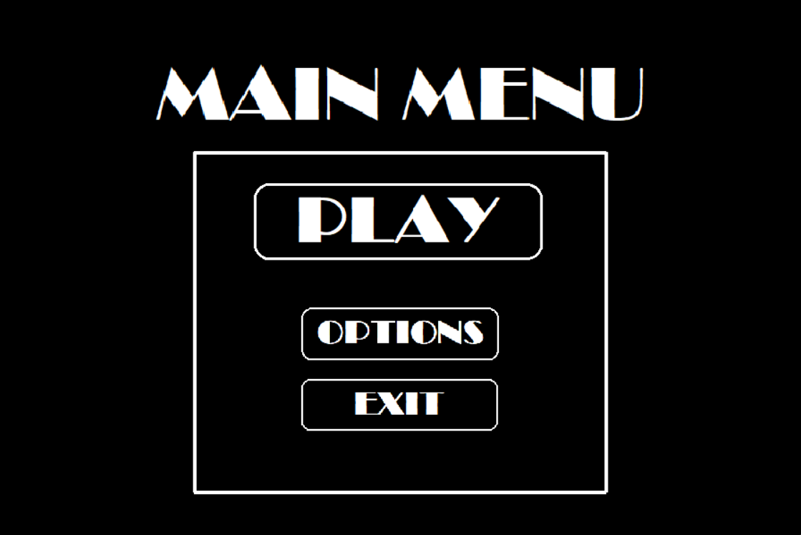
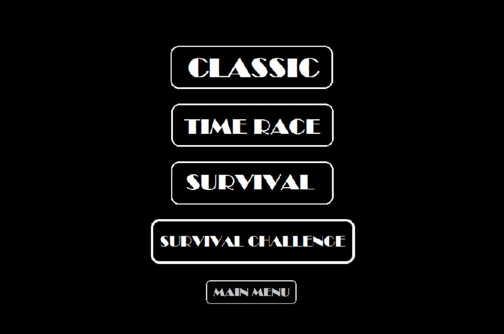
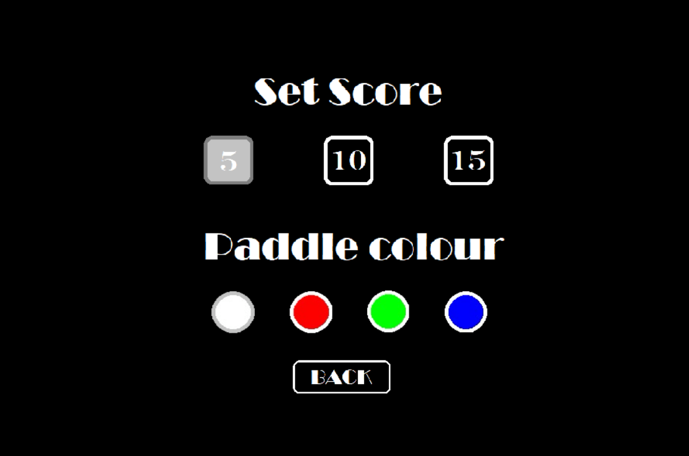
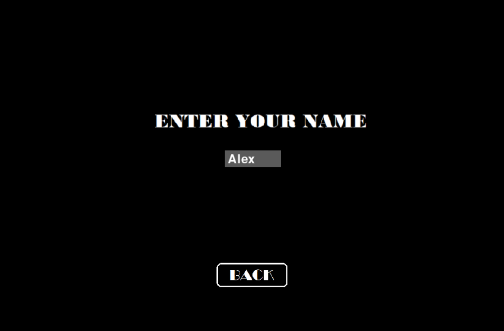
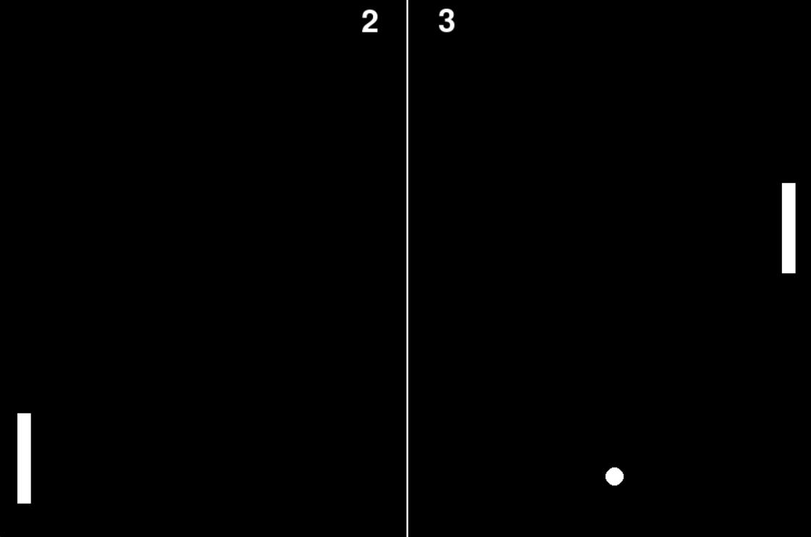
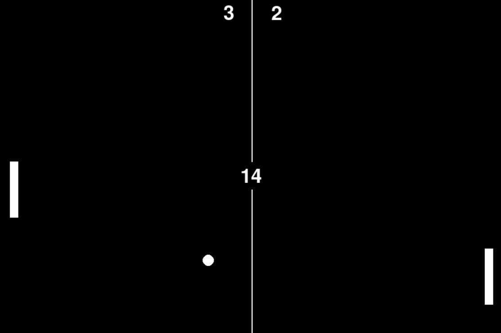
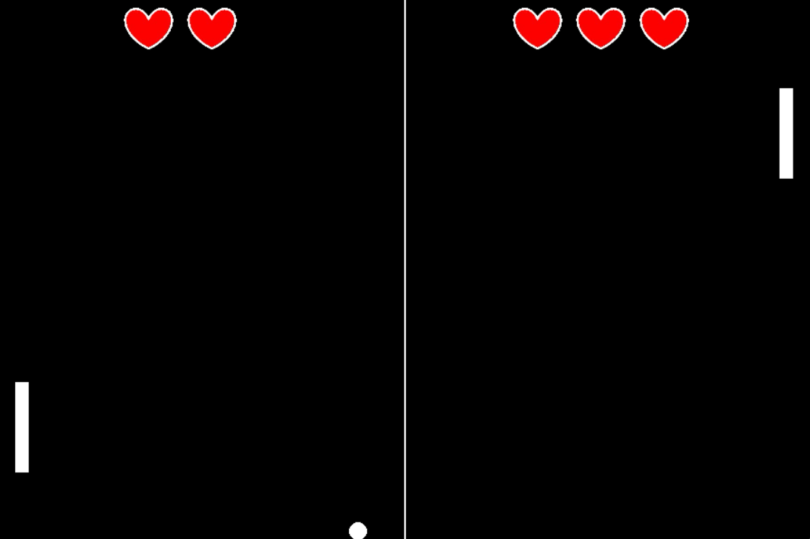
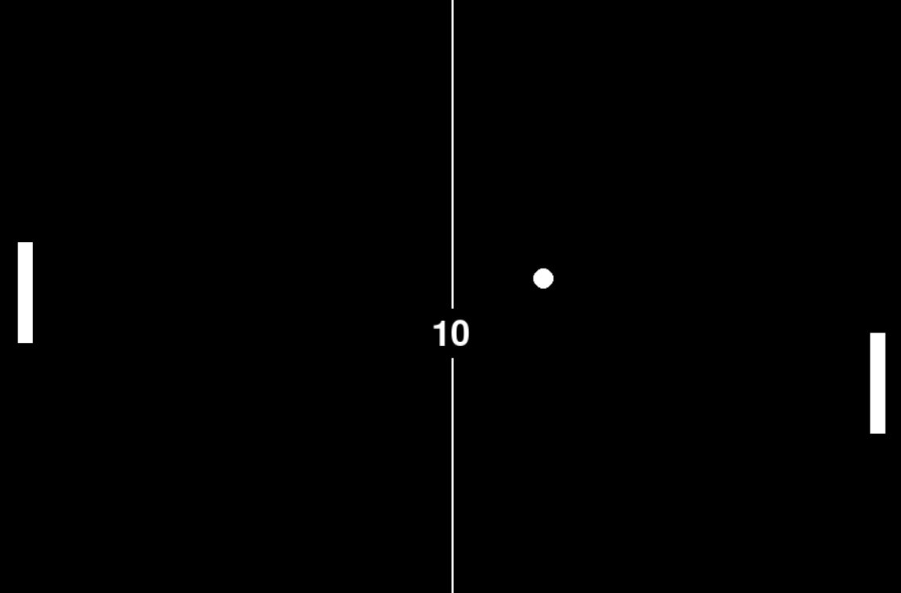

# 🏓 Pong Game

A feature-rich take on classic Pong, built with Python and Pygame — full menu system,
multiple game modes, paddle customization, sound effects, and a persistent local
leaderboard.

<p align="center">
  
</p>

---

## ✨ Features

- **Single-player and two-player modes**
- **Four game modes**, selectable from Play → mode select:

  <p align="center">
    
  </p>

  - **Classic** — first to a target score wins
  - **Time Race** — score as much as possible before the countdown ends
  - **Survival** — limited lives (hearts); lose one each time you miss the ball
  - **Survival Challenge** — a harder variant of Survival

- **Selectable target score** (5 / 10 / 15) and **paddle color** (white / red / green / blue), from the options screen:

  <p align="center">
    
  </p>

- **Persistent leaderboard** — enter your name after a match and your score is saved locally between sessions:

  <p align="center">
    
  </p>

- **Sound effects and background music** (paddle hits, scoring, game over)

### More gameplay

<p align="center">
  
  
</p>
<p align="center">
  
  
</p>

---

## 🗂 Project Structure

```
Pong-Game/
├── src/
│   ├── main.py              # The full game — menus, modes, rendering, everything
│   ├── leaderboard.json     # Saved local high scores (created/updated at runtime)
│   └── assets/               # Images, sounds, and the window icon
│
├── early-prototype/
│   └── pong_prototype.py    # The very first version — bare-bones two-paddle pong,
│                             # no menus, no sound. Kept to show how the project grew.
│
├── docs/
│   ├── Project Expo Summary.pdf
│   ├── pong.docx
│   └── screenshot-*.png     # Screenshots used in this README
│
└── requirements.txt
```

---

## 🚀 How to Run

```bash
git clone https://github.com/Mudasir24/Pong-Game.git
cd Pong-Game
pip install -r requirements.txt
python src/main.py
```

The leaderboard file (`src/leaderboard.json`) is created automatically the first
time you play if it doesn't already exist, and updates as new high scores are set.

---

## 🎮 Controls

| Player | Move Up | Move Down |
|---|---|---|
| Left paddle | `W` | `S` |
| Right paddle | `↑` (Up Arrow) | `↓` (Down Arrow) |

---

## 🛠 Tech Stack

Python + [Pygame](https://www.pygame.org/) — no other dependencies.

---

## 📄 Project Docs

Additional writeups from when this was built as an expo project are in
[`docs/`](./docs): a project summary PDF and a Word doc with more detail.
